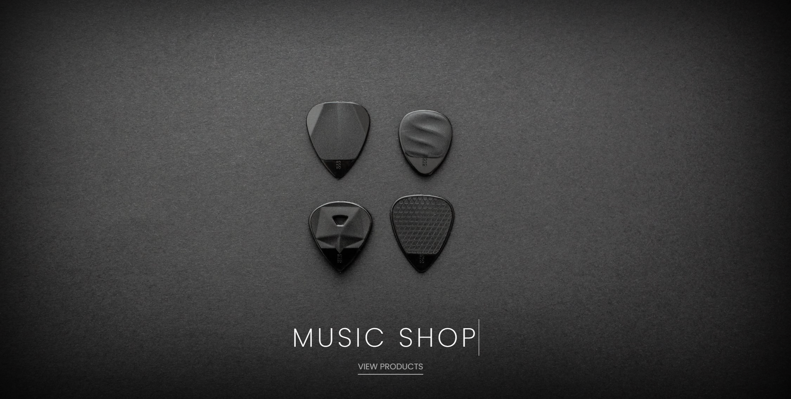
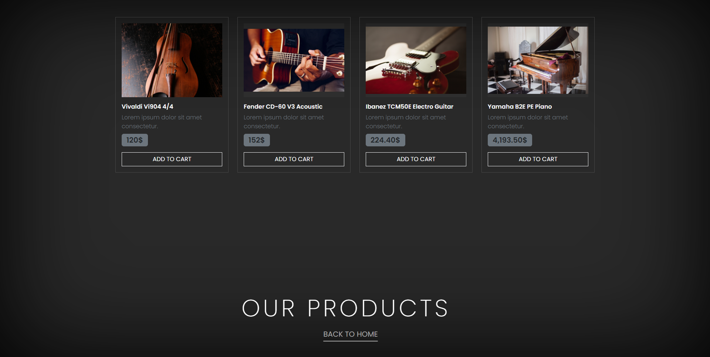

# Bootstrap-Tasks
The tasks I've done throughout the Bootstrap course of Patika.Dev. 

## Task 1: Music Shop Website

I designed a basic two-page website that contains a simple homepage and products page. I tried to make it responsive as possible as I can. I hope you found this useful.

### Preview:

Homepage:

Products Page:

## Task 2: Instagram Clone

I re-edited the [project](https://drive.google.com/drive/folders/1hRWmpYpuax4Aqsf_BRKdpDoNUowTpzKe) codes, that has been given by [Kodluyoruz](https://www.kodluyoruz.org/), according to the construction of the task of [Patika.Dev Bootstrap Course](https://app.patika.dev/courses/bootstrap/odev2).

### Preview:

It looks like this:

to be continued...
